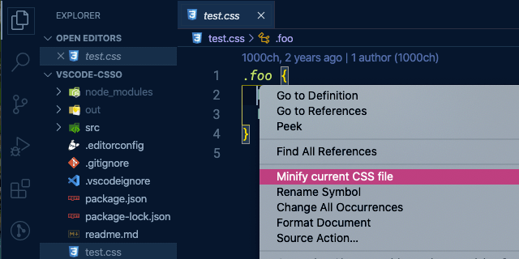
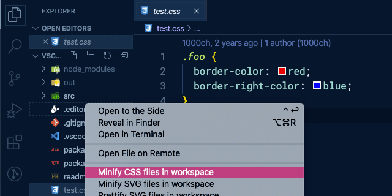

# vscode-csso

Minify CSS with [CSSO](http://github.com/css/csso).

## Install

Execute `Extensions: Install Extensions` command from [Command Palette](https://code.visualstudio.com/docs/getstarted/userinterface#_command-palette) (<kbd>Cmd</kbd> <kbd>Shift</kbd> <kbd>P</kbd>) and search by **csso**.

## Usage

Open the Command Palette (<kbd>Cmd</kbd> <kbd>Shift</kbd> <kbd>P</kbd>) and search following commands.

- **Minify current CSS file**: to minify current CSS file
- **Minify selected part of CSS**: to minify selected part of CSS
- **Minify CSS files in workspace**: to minify all CSS files in workspace

You can also execute these commands from context menu of [Explorer](https://code.visualstudio.com/docs/getstarted/userinterface#_explorer) or Editor.

## Config

### [restructure](https://github.com/css/csso#compressast-options)

`true` as default. If you want to disable, set `false`.

## License

[MIT](https://1000ch.mit-license.org) © [Shogo Sensui](https://github.com/1000ch)
